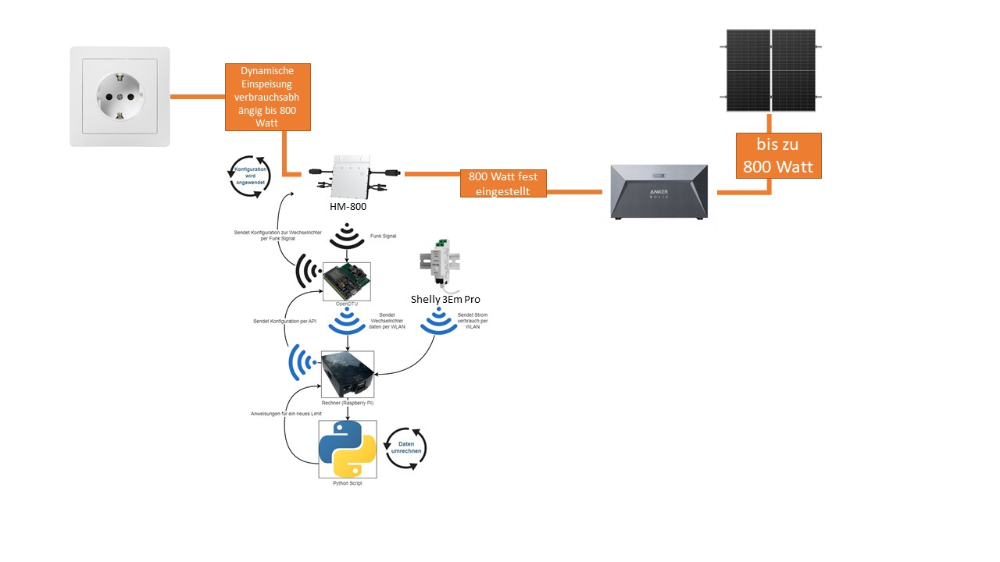

# Nulleinspeisung Hoymiles HM-600 HM-800 mit OpenDTU & Python Steuerung

Dies ist ein Python-Skript, das den aktuellen Hausverbrauch aus einem Shelly 3EM pro ausliest, die Nulleinspeisung berechnet und die Ausgangsleistung eines Hoymiles-Wechselrichters mit Hilfe der OpenDTU entsprechend anpasst. Somit wird kein unnötiger Strom ins Betreibernetz abgegeben.

Möglich ist auch die Steuerung eines Speichers

## Autoren und Anerkennung
- Dieses Skript ist ein Fork von: https://github.com/Selbstbau-PV/Selbstbau-PV-Hoymiles-nulleinspeisung-mit-OpenDTU-und-Shelly3EM
- Dieses Skript ist ursprünglich ein Fork von: https://gitlab.com/p3605/hoymiles-tarnkappe
- Dieses Script wurde mit den Kommentaren von GZI erweitert https://solaranzeige.de/phpBB3/viewtopic.php?t=3842
- Ein großes Lob und Dank an die OpenDTU community: https://github.com/tbnobody/OpenDTU

## Wiki
- Weitere Informationen finden Sie auf der Seite: https://selbstbau-pv.de/wissensbasis/nulleinspeisung-hoymiles-hm-1500-mit-opendtu-python-steuerung/

## Haftung

Entbindung jeglicher Gewährleistung:

Bitte beachten Sie, dass die Nutzung eines Python-Skripts oder die Durchführung einer beschriebenen Idee auf eigene Gefahr erfolgt. Es wird keine ausdrückliche oder stillschweigende Gewährleistung in Bezug auf die Funktionalität, Sicherheit oder Eignung für einen bestimmten Zweck gewährt.

Das Python-Skript und die beschriebene Idee werden "wie sie sind" zur Verfügung gestellt, ohne jegliche Zusicherung oder Garantie, weder ausdrücklich noch stillschweigend. Es wird insbesondere keine Gewährleistung dafür übernommen, dass das Skript fehlerfrei, zuverlässig, vollständig oder für Ihre spezifischen Anforderungen geeignet ist.

Der Nutzer trägt die volle Verantwortung für die Verwendung des Skripts oder die Umsetzung der beschriebenen Idee. Jegliche Schäden, die aus der Nutzung des Skripts oder der Idee entstehen könnten, liegen in der alleinigen Verantwortung des Nutzers, und es wird keine Haftung übernommen.

Es wird dringend empfohlen, vor der Verwendung des Skripts oder der Umsetzung der Idee eine sorgfältige Prüfung und gegebenenfalls eine fachliche Beratung durchzuführen. Der Entwickler oder die verantwortliche Person übernimmt keinerlei Verantwortung oder Haftung für Schäden, die direkt oder indirekt aus der Verwendung des Skripts oder der Idee resultieren.

Durch die Nutzung des Python-Skripts oder die Umsetzung der Idee erklären Sie sich ausdrücklich damit einverstanden, den Entwickler und alle beteiligten Parteien von jeglicher Haftung freizustellen und zu entschädigen.

Bitte denken Sie daran, dass Programmierung und technische Umsetzungen mit Risiken verbunden sein können. Wenn Sie Bedenken haben oder nicht mit den Bedingungen dieser Entbindung jeglicher Gewährleistung einverstanden sind, wird von der Nutzung des Skripts oder der Idee abgeraten.
